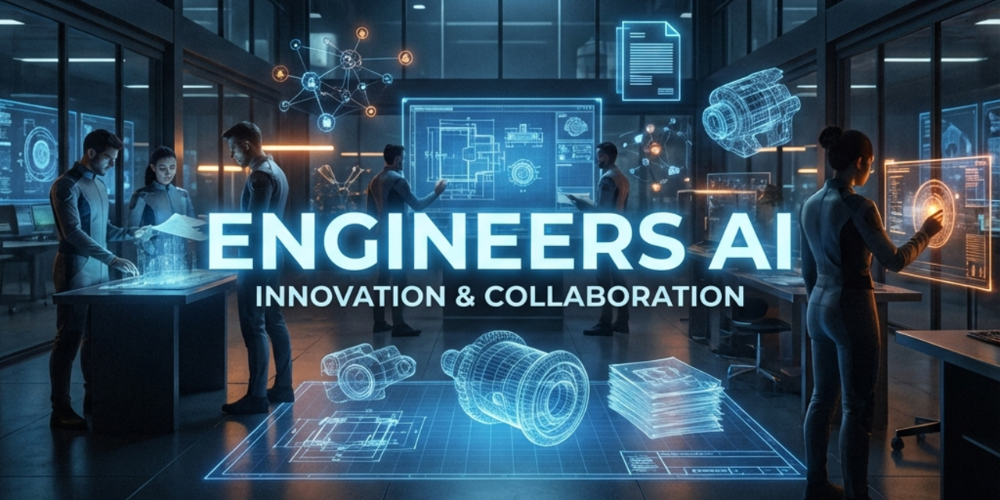
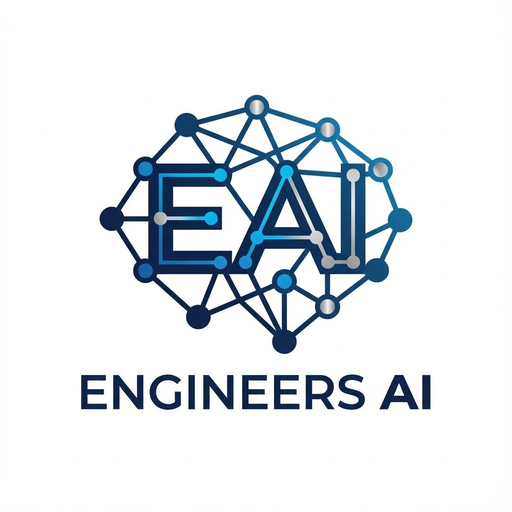

  

  

<h1 align="center">Engineers AI</h1>

  <b>Building the Future of Autonomous Engineering</b>

  Engineers AI is dedicated to revolutionizing the engineering lifecycle through advanced artificial intelligence. Our suite of tools seamlessly integrates high-performance computing, microservices, and state-of-the-art AI to automate compliance, optimize design, and intelligentize document processing.

---

## 🚀 Key Projects

### 🧭 [CAD Navigator](https://github.com/engineers-ai/cad-navigator)
**Intelligent Geometric Querying & Processing**
A high-performance system extending Oxidize-RAG for 3D CAD workflows. Features Rust-based geometry parsing, AI-driven natural language queries, and efficient metadata extraction.

### 🔥 [Oxidize-RAG](https://github.com/engineers-ai/oxidize-rag)
**Production-Grade Retrieval-Augmented Generation**
An enterprise-grade polyglot microservices system (Rust, Go, Python) for processing documents and delivering intelligent, context-aware answers.

### 🛡️ [Spec Guardian](https://github.com/engineers-ai/spec-guardian)
**Automated Compliance & Validation Engine**
Ensure design integrity and regulatory compliance with this real-time validation engine. Capabilities include thermal analysis, GD&T verification, and automated report generation.

---

  <i>Empowering engineers with the intelligence to build faster, safer, and smarter.</i>

